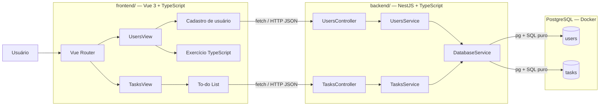

# SOURCE OF TRUTH — Desafio Técnico Fullstack Júnior

> **Status:** este documento é a **Source of Truth oficial do projeto**.
>
> Toda pessoa ou agente de IA que trabalhar neste repositório deve ler este arquivo antes de tomar decisões ou modificar a aplicação.
>
> Em caso de conflito entre este documento e qualquer sugestão, implementação, comentário, documentação ou convenção externa, **este documento prevalece**, salvo alteração explícita deste próprio arquivo.

---

# 1. Objetivo

Construir uma aplicação fullstack local, simples e integrada para atender os **cases 1 a 8** do desafio técnico para Pessoa Desenvolvedora Fullstack Júnior.

A solução deve demonstrar:

- fundamentos de HTML e CSS;
- Vue 3 com Composition API;
- TypeScript;
- PostgreSQL e SQL;
- NestJS;
- integração HTTP;
- organização de projeto;
- Git;
- raciocínio de troubleshooting;
- uso consciente de IA.

O projeto deve permanecer compatível com o nível esperado de uma vaga **Júnior**.

---

# 2. Princípios

## 2.1. Simplicidade

Priorizar sempre:

- código direto;
- poucas dependências;
- conceitos fundamentais;
- organização fácil de explicar;
- baixa abstração;
- execução local simples.

Evitar:

- arquitetura excessiva;
- patterns avançados sem necessidade;
- abstrações desnecessárias;
- bibliotecas que substituam fundamentos importantes do desafio.

## 2.2. Tudo local

A aplicação será executada localmente:

- Vue local;
- NestJS local;
- PostgreSQL via Docker;
- comunicação via HTTP + JSON.

## 2.3. Monorepo

Será utilizado **um único repositório Git**.

Estrutura raiz:

```text
desafio-tecnico/
├── frontend/
├── backend/
├── README.md
├── SOURCE_OF_TRUTH.md
└── EXPLICACOES.md
```

Não utilizar:

- Nx;
- Turborepo;
- workspaces;
- shared packages.

---

# 3. Arquitetura



---

# 4. Stack oficial

| Área | Tecnologia |
|---|---|
| Monorepo | Git |
| Frontend | Vue 3 |
| Build frontend | Vite |
| Linguagem frontend | TypeScript |
| API Vue | Composition API |
| Rotas frontend | Vue Router |
| Estado | `ref` e `computed` |
| HTTP | `fetch` nativo |
| CSS | CSS puro global |
| Backend | NestJS |
| Linguagem backend | TypeScript |
| Config backend | `@nestjs/config` |
| Validação backend | `class-validator` + `class-transformer` |
| Banco | PostgreSQL |
| Driver PostgreSQL | `pg` |
| SQL | SQL puro |
| Banco em container | Docker Compose |
| ORM | Nenhum |
| Testes unitários | Não |
| Testes E2E | Não |
| Deploy | Não |
| Ambiente | Local |

---

# 5. Estrutura do projeto

```text
desafio-tecnico/
│
├── frontend/
│   ├── src/
│   │   ├── components/
│   │   │   ├── Sidebar.vue
│   │   │   ├── UserForm.vue
│   │   │   ├── UsersList.vue
│   │   │   ├── TodoForm.vue
│   │   │   └── TodoItem.vue
│   │   │
│   │   ├── views/
│   │   │   ├── UsersView.vue
│   │   │   └── TasksView.vue
│   │   │
│   │   ├── services/
│   │   │   ├── users.service.ts
│   │   │   └── tasks.service.ts
│   │   │
│   │   ├── types/
│   │   │   ├── user.ts
│   │   │   └── task.ts
│   │   │
│   │   ├── utils/
│   │   │   └── filterByNumericField.ts
│   │   │
│   │   ├── router/
│   │   │   └── index.ts
│   │   │
│   │   ├── App.vue
│   │   ├── main.ts
│   │   └── style.css
│   │
│   ├── index.html
│   ├── package.json
│   ├── tsconfig.json
│   └── README.md
│
├── backend/
│   ├── src/
│   │   ├── database/
│   │   │   ├── database.module.ts
│   │   │   └── database.service.ts
│   │   │
│   │   ├── users/
│   │   │   ├── dto/
│   │   │   │   └── create-user.dto.ts
│   │   │   ├── users.controller.ts
│   │   │   ├── users.service.ts
│   │   │   └── users.module.ts
│   │   │
│   │   ├── tasks/
│   │   │   ├── dto/
│   │   │   │   ├── create-task.dto.ts
│   │   │   │   └── update-task.dto.ts
│   │   │   ├── tasks.controller.ts
│   │   │   ├── tasks.service.ts
│   │   │   └── tasks.module.ts
│   │   │
│   │   ├── app.module.ts
│   │   └── main.ts
│   │
│   ├── database/
│   │   └── init.sql
│   │
│   ├── docker-compose.yml
│   ├── .env
│   ├── .env.example
│   ├── package.json
│   └── tsconfig.json
│
├── README.md
├── SOURCE_OF_TRUTH.md
└── EXPLICACOES.md
```

> A estrutura pode ser ajustada durante a implementação caso um arquivo se revele desnecessário, desde que a arquitetura e as responsabilidades permaneçam iguais.

---

# 6. Frontend

## 6.1. Vue

Utilizar:

```text
Vue 3
Vite
TypeScript
Composition API
Vue Router
```

Não utilizar:

- Pinia;
- Vuex;
- Axios;
- Tailwind;
- frameworks CSS;
- bibliotecas de validação de formulário.

---

# 7. Navegação

A aplicação terá uma sidebar simples.

Rotas:

```text
/users
/tasks
```

Estrutura visual aproximada:

```text
┌────────────────┬─────────────────────────────┐
│                │                             │
│  Desafio       │                             │
│                │       Página atual          │
│  Usuários      │                             │
│  Tarefas       │                             │
│                │                             │
└────────────────┴─────────────────────────────┘
```

O Vue Router será responsável pela navegação entre as páginas.

---

# 8. CSS

Será utilizado **CSS puro global**.

Arquivo oficial:

```text
frontend/src/style.css
```

Ele será importado por:

```text
frontend/src/main.ts
```

Todos os componentes e views poderão utilizar as classes declaradas nesse arquivo.

Não utilizar por padrão:

```vue
<style scoped>
```

Não utilizar:

- Tailwind;
- Sass;
- CSS Modules;
- styled-components;
- bibliotecas de UI.

O objetivo é manter o CSS visível e simples para todo o projeto.

---

# 9. Case 1 — HTML + CSS

Criar um formulário de cadastro contendo:

- Nome;
- E-mail;
- Senha;
- botão estilizado;
- validações básicas.

## Validação

Utilizar:

- recursos nativos de HTML;
- TypeScript quando necessário.

Exemplos:

```html
required
type="email"
```

Não usar bibliotecas de validação no frontend.

## Senha

O campo de senha existe para atender ao exercício de HTML/CSS.

A senha:

- deve ser validada no frontend;
- não será enviada ao backend;
- não será persistida;
- não terá autenticação associada;
- não fará parte da tabela `users`.

O `POST /users` continuará recebendo apenas:

```json
{
  "name": "Ana",
  "email": "ana@email.com"
}
```

---

# 10. Case 2 — Vue 3 / To-do List

A aplicação terá uma página:

```text
/tasks
```

Funcionalidades:

- adicionar tarefa;
- marcar tarefa como concluída;
- remover tarefa;
- filtrar:
  - todas;
  - pendentes;
  - concluídas.

## Composition API

Utilizar principalmente:

```text
ref
computed
```

Não adicionar biblioteca de gerenciamento de estado.

## Persistência

As tarefas serão persistidas no PostgreSQL.

Fluxo:

```text
TasksView
   ↓
fetch
   ↓
NestJS
   ↓
pg
   ↓
PostgreSQL
```

Endpoints:

```http
GET    /tasks
POST   /tasks
PATCH  /tasks/:id
DELETE /tasks/:id
```

---

# 11. Case 3 — TypeScript

O exercício de TypeScript será demonstrado diretamente no frontend.

Dados do exercício:

```ts
const users = [
  { id: 1, name: 'Ana', age: 25 },
  { id: 2, name: 'Pedro', age: 30 },
  { id: 3, name: 'Maria', age: 22 },
]
```

Criar uma função tipada que:

- receba o array;
- retorne os nomes dos usuários com mais de 23 anos.

Também implementar o bônus:

- função genérica;
- filtragem por qualquer campo numérico.

Arquivo sugerido:

```text
frontend/src/utils/filterByNumericField.ts
```

A página de usuários poderá conter botões simples para demonstrar visualmente a filtragem.

Exemplo:

```text
Demonstração TypeScript

[Todos]
[Maiores de 23 anos]

Ana
Pedro
```

## Regra importante

O campo `age` pertence ao exercício específico de TypeScript.

Ele **não será adicionado à tabela real `users` apenas para atender esse case**.

---

# 12. Case 4 — PostgreSQL / SQL

Banco oficial:

```text
PostgreSQL
```

Execução:

```text
Docker Compose
```

Arquivo:

```text
backend/docker-compose.yml
```

O Docker será utilizado **somente para PostgreSQL**.

---

# 13. Schema SQL

Arquivo oficial:

```text
backend/database/init.sql
```

Utilizar SQL puro.

Tabela `users`:

```sql
CREATE TABLE IF NOT EXISTS users (
    id SERIAL PRIMARY KEY,
    name VARCHAR(255) NOT NULL,
    email VARCHAR(255) NOT NULL UNIQUE,
    created_at TIMESTAMP NOT NULL DEFAULT CURRENT_TIMESTAMP
);
```

Tabela `tasks`:

```sql
CREATE TABLE IF NOT EXISTS tasks (
    id SERIAL PRIMARY KEY,
    title VARCHAR(255) NOT NULL,
    completed BOOLEAN NOT NULL DEFAULT FALSE,
    created_at TIMESTAMP NOT NULL DEFAULT CURRENT_TIMESTAMP
);
```

---

# 14. Queries do Case 4

Listar usuários do mais recente para o mais antigo:

```sql
SELECT id, name, email, created_at
FROM users
ORDER BY created_at DESC;
```

Bônus — quantidade de usuários criados por mês:

```sql
SELECT
    TO_CHAR(created_at, 'YYYY-MM') AS month,
    COUNT(*) AS total
FROM users
GROUP BY TO_CHAR(created_at, 'YYYY-MM')
ORDER BY month DESC;
```

As queries devem ser explicadas no `EXPLICACOES.md`.

---

# 15. Acesso ao banco

Não utilizar ORM.

Não utilizar:

- Prisma;
- TypeORM;
- Sequelize.

Utilizar:

```text
pg
```

A conexão será encapsulada em:

```text
src/database/database.service.ts
```

Responsabilidade:

- criar e manter `Pool`;
- executar queries;
- fornecer acesso simples ao PostgreSQL.

Estrutura:

```text
DatabaseModule
    ↓
DatabaseService
    ↓
pg Pool
    ↓
PostgreSQL
```

---

# 16. Variáveis de ambiente

Backend:

```text
backend/.env
backend/.env.example
```

Variáveis esperadas:

```env
DB_HOST=localhost
DB_PORT=5432
DB_NAME=desafio
DB_USER=postgres
DB_PASSWORD=postgres
```

Os valores finais podem ser alterados durante o setup, mas a estrutura permanece.

Utilizar:

```text
@nestjs/config
```

para carregar configurações.

---

# 17. Case 5 — NestJS

Endpoints de usuários:

```http
GET /users
POST /users
```

Endpoints de tarefas:

```http
GET    /tasks
POST   /tasks
PATCH  /tasks/:id
DELETE /tasks/:id
```

---

# 18. Organização NestJS

## Users

```text
users/
├── dto/
│   └── create-user.dto.ts
├── users.controller.ts
├── users.service.ts
└── users.module.ts
```

## Tasks

```text
tasks/
├── dto/
│   ├── create-task.dto.ts
│   └── update-task.dto.ts
├── tasks.controller.ts
├── tasks.service.ts
└── tasks.module.ts
```

## Database

```text
database/
├── database.module.ts
└── database.service.ts
```

---

# 19. Validação backend

Utilizar:

```text
class-validator
class-transformer
```

E o mecanismo de validação do NestJS.

Exemplo conceitual:

```ts
export class CreateUserDto {
  @IsString()
  @IsNotEmpty()
  name: string

  @IsEmail()
  email: string
}
```

O backend não recebe senha.

---

# 20. CORS

CORS deverá ser habilitado no NestJS.

Uso exclusivamente local.

Origem esperada:

```text
http://localhost:5173
```

---

# 21. Portas padrão

```text
Frontend:   5173
Backend:    3000
PostgreSQL: 5432
```

---

# 22. Services frontend

Utilizar `fetch` nativo.

Arquivos:

```text
src/services/users.service.ts
src/services/tasks.service.ts
```

Responsabilidades:

- centralizar requests HTTP;
- manter os componentes focados em interface e estado.

Não utilizar Axios.

---

# 23. Página Users

Rota:

```text
/users
```

Deve conter, de forma simples:

- formulário de cadastro;
- lista de usuários persistidos;
- demonstração do exercício de TypeScript.

Fluxo de cadastro:

```text
UserForm
   ↓
fetch POST /users
   ↓
NestJS
   ↓
pg
   ↓
PostgreSQL
```

Fluxo de leitura:

```text
PostgreSQL
   ↓
NestJS
   ↓
GET /users
   ↓
Vue
```

---

# 24. Página Tasks

Rota:

```text
/tasks
```

Deve conter:

- input para nova tarefa;
- botão adicionar;
- filtros;
- lista de tarefas;
- ação concluir/reabrir;
- ação remover.

Exemplo:

```text
Minhas tarefas

[ Nova tarefa........ ][Adicionar]

[Todas] [Pendentes] [Concluídas]

☐ Estudar Vue
☑ Fazer desafio técnico
☐ Revisar código
```

Todas as alterações serão persistidas no PostgreSQL.

---

# 25. Case 6 — Git

Utilizar um único repositório.

O histórico deve mostrar evolução real.

No mínimo 3 commits.

Exemplo:

```text
chore: initialize monorepo structure

feat: implement Vue pages and navigation

feat: add NestJS API and PostgreSQL persistence

docs: document project decisions and challenge answers
```

Não fazer apenas um commit final.

Não criar commits artificiais em excesso.

---

# 26. Case 7 — Organização

A resposta do case será demonstrada pela estrutura real do projeto.

Frontend:

```text
components
views
services
types
utils
router
```

Backend:

```text
database
users
tasks
```

O backend será organizado por feature.

O frontend será organizado por responsabilidade.

---

# 27. Case 8 — Login lento

Não implementar autenticação real.

Não criar tela de login apenas para este case.

Responder no `EXPLICACOES.md` como exercício de troubleshooting.

Primeiras verificações:

## Browser / Network

- tempo total;
- TTFB;
- requests lentas;
- requests duplicadas;
- tamanho do payload;
- códigos HTTP.

## Backend

- tempo da rota;
- processamento desnecessário;
- logs;
- chamadas externas.

## Banco

- queries lentas;
- quantidade de queries;
- índices;
- dados desnecessários.

## Frontend

- bundle;
- requests disparadas no carregamento;
- renderizações desnecessárias.

Apresentar pelo menos duas soluções possíveis com base no diagnóstico.

---

# 28. Testes

Não serão adicionados:

- testes unitários;
- testes E2E;
- Vitest;
- Jest adicional;
- Cypress;
- Playwright.

Caso scaffolds gerem arquivos de teste automaticamente, eles podem ser removidos se não forem necessários.

O desafio será validado manualmente.

---

# 29. Documentação

## SOURCE_OF_TRUTH.md

Este documento.

Contém:

- decisões oficiais;
- arquitetura;
- stack;
- escopo;
- restrições.

## README.md

Deve conter:

- objetivo;
- stack;
- pré-requisitos;
- instalação;
- como iniciar PostgreSQL;
- como iniciar backend;
- como iniciar frontend;
- portas;
- endpoints;
- estrutura resumida.

## EXPLICACOES.md

Deve responder:

- Case 1;
- Case 2;
- Case 3;
- Case 4;
- Case 5;
- Case 6;
- Case 7;
- Case 8;
- bônus;
- estratégia de commits;
- uso de ferramentas de IA.

---

# 30. Uso de IA

IA pode auxiliar em:

- planejamento;
- implementação;
- explicação;
- debugging;
- revisão;
- documentação.

Todo código final deve permanecer compreensível para o candidato.

O candidato precisa ser capaz de:

- explicar;
- alterar;
- depurar;
- justificar.

---

# 31. Fora de escopo

Não adicionar:

- ORM;
- Prisma;
- TypeORM;
- autenticação;
- JWT;
- refresh token;
- OAuth;
- Redis;
- filas;
- Kafka;
- RabbitMQ;
- GraphQL;
- microserviços;
- Kubernetes;
- cloud;
- CI/CD complexo;
- Nx;
- Turborepo;
- Pinia;
- Vuex;
- Axios;
- Tailwind;
- frameworks CSS;
- testes unitários;
- testes E2E;
- Docker para frontend;
- Docker para backend.

---

# 32. Critério de sucesso

A aplicação final deve demonstrar este fluxo:

```text
Vue 3
+ TypeScript
+ Vue Router
+ CSS puro
       │
       │ fetch / JSON
       ▼
NestJS
+ DTO validation
       │
       │ pg / SQL puro
       ▼
PostgreSQL
Docker
```

Além disso:

```text
HTML + CSS
Composition API
TypeScript generics
SQL
Git
Organização
Troubleshooting
Uso consciente de IA
```

Todos os bônus solicitados pelo desafio devem estar contemplados.

---

# 33. Regras para agentes de IA

Antes de modificar o projeto:

1. Ler este documento integralmente.
2. Respeitar todas as decisões registradas.
3. Não adicionar dependências não previstas sem justificativa.
4. Não introduzir ORM.
5. Não introduzir arquitetura avançada.
6. Manter o projeto adequado ao nível Júnior.
7. Preferir código explícito a abstrações.
8. Manter frontend e backend separados dentro do monorepo.
9. Manter Docker restrito ao PostgreSQL.
10. Utilizar SQL puro.
11. Utilizar `fetch` no frontend.
12. Utilizar `ref` e `computed` para estado.
13. Manter CSS global em `frontend/src/style.css`.
14. Não adicionar testes automatizados.
15. Garantir que o candidato consiga explicar o código.
16. Atualizar este documento somente quando uma decisão oficial mudar.

---

# 34. Resumo final

```text
desafio-tecnico/
│
├── frontend/
│   └── Vue 3 + Vite + TypeScript
│       + Composition API
│       + Vue Router
│       + fetch
│       + CSS global
│
├── backend/
│   └── NestJS + TypeScript
│       + @nestjs/config
│       + class-validator
│       + pg
│       + SQL puro
│
│   ├── database/init.sql
│   └── docker-compose.yml
│
├── README.md
├── SOURCE_OF_TRUTH.md
└── EXPLICACOES.md
```

**Princípio central:** resolver o desafio de forma integrada, simples, explícita e tecnicamente coerente com uma vaga Fullstack Júnior.
